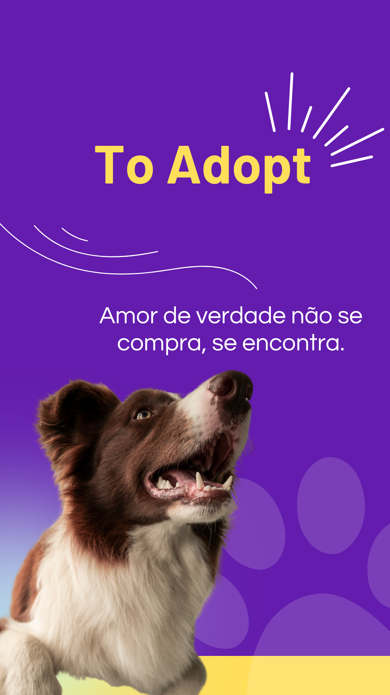

# To Adopt
Projeto individual realizado pela aluna Sophia Rosário na faculdade SPtech. To Adopt é um site que visa auxiliar na comunicação entre ONGS e indivíduos que almejam adotar um pet.

Para a codificação desse site com as funcionalidades cadastro, login, quiz, dashboard e comentários foi ultlizado HTML/CSS e JAVA SCRIPT.

## Documentação de cores
| Cor               | Hexadecimal                                                |
| ----------------- | ---------------------------------------------------------------- |
| Cor exemplo       |  #631cad |
| Cor exemplo       |  #ffde59 |

## Documentação
[Documentação](/documentacao/toadopt.docx)

## Autores
- [Sophia Rosário](https://github.com/sophiaRosario)

## Feedback

Se você tiver algum feedback, por favor deixe me saber por meio de sophia.jesus@sptech.school
